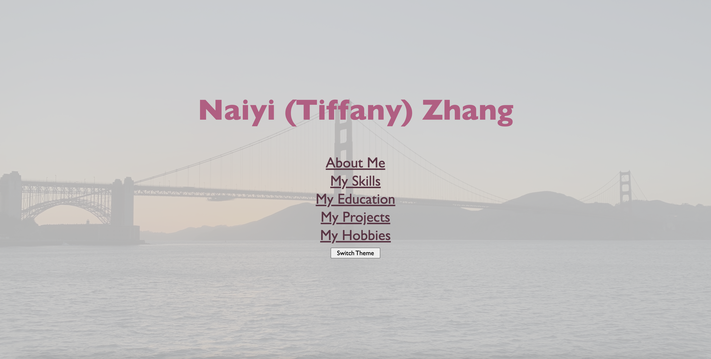

# Tiffany's Personal Home Page
This project contains my personal home page demonstrating my basic information, the skills I'm mastered with, my education and courses I've taken, projects I've done, and my hobbies.
[My Design](./docs/Design.pdf)

## Table of Contents

- [About](#about)
- [Author](#author)
- [Tech Requirements](#tech)
- [Usage](#usage)
- [Version History](#version)
- [License](#license)

##  About

The objective of building this home page is to showcase myself, to share my values, expertise, and unique qualities to people who don't know me well or those who are interested in my work. As a digital representation of myself, this home page provides a comprehensive and organized overview of who I am, what I am capable of doing, and what I am passionate about. Creating this home page not only promotes my personal development, it servers a lot more purposes such as networking and professional branding. Ultimately, it keeps a record of all the paths I've been through and all the work I've done.  

My home page covers a diverse range of target audiences, including my current colleagues and peers, my potential recruiters and employers, and communities that share a same hobby. I will be developing this webpage further in the future to meet both my short-term and long-term goals.  

Video demo: https://drive.google.com/file/d/18djQYWhYFykLF9V6_afcTV8s3kADzeJH/view?usp=drive_link 

##  Author
Author: Naiyi (Tiffany) Zhang  
Email: tiffanyxkg@gmail.com  
LinkedIn: www.linkedin.com/in/tiffanyxk  
Webpage: https://tiffanyxk3.github.io/TiffanysHomePage/  
Class link: https://johnguerra.co/classes/webDevelopment_fall_2023/  

##  Tech Requirements

* HTML
* CSS
* JavaScript
* Bootstrap

##  Usage

Opening the webpage shows the main page of my project. The "Switch Theme" button allows users to switch between light theme and dark theme. Each sub-page (About Me, My Skills, My Education, My Projects, My Hobbies) is linked to their titles displayed on the main page. By clicking each of the links, the user is brought to each sub-page where specific information about myself is covered. To navigate back to the main page, there is a "Back to Main Page" button at the bottom of each sub-page. 

##  Version History
* v1.0.0
  * Initial Release
  * Basic components including the main page, the skills page, the education page, the projects page, and the hobbies page

##  License

Distributed under the MIT License. See [LICENSE](./LICENSE) for more information.
